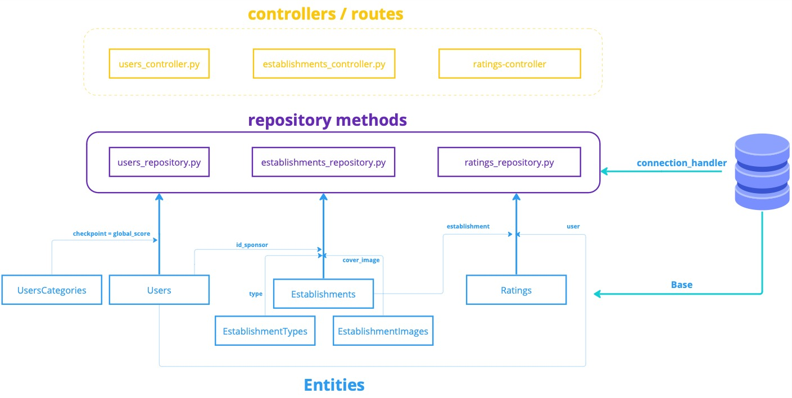

# LevaEu

LevaEu is a dynamic platform designed to connect people with establishments, offering families an enjoyable and memorable day out. This project is in the early stages of developing a Minimum Viable Product (MVP) as part of a postgraduate Software Engineering sprint at PUC-RJ.

The architecture employs the MVC pattern, with distinct repositories for the frontend and backend. You can explore the frontend repository [here](https://github.com/gabrielsacampos/levaeu-front).

## Getting Started
### Prerequisites
To get started with this project, you need to clone this repository to your local machine. Follow these steps:

1. Open your terminal.
2. Navigate to the directory where you want the cloned directory to be located.
3. Execute the git clone command:
    ```bash
    git clone https://github.com/gabrielsacampos/levaeu-back.git
    ```
This command clones the backend repository into your chosen directory.

#### Installation
To set up the project on your local machine:

1. Navigate to the project directory:
      ```bash
    cd levaeu-back
    ```
2. Recommend using a virtual environment:
```bash
   python3 -m venv env
   source env/bin/activate
```

3. Install the required dependencies:
   ```bash
   (env)$ pip install -r requirements.txt
   ```

4. To run the server:
```bash
   (env)$ python app.py
```
Once the server is running, you can start the frontend interface [here](https://github.com/gabrielsacampos/levaeu-front).


### Troubleshooting
If you encounter a __ModuleNotFoundError__, you can set the Python path by running:
```bash    
    export PYTHONPATH=./:$PYTHONPATH
```

### Project Structure


#### storage.sqlite3
   - Contains a pre-populated SQLite database with sample data for testing and development purposes.

#### seeds 
 When need, we can reseed our database with:
 ```bash
   python seeds/seeder.py
 ```
   This script utilizes pandas to **DROP** each table and reseed them using data from an Excel file located at _.seed/seed.xlsx.
     
### src
- __Models__
   - __Entities__: Defines the database schema, including:
      * User Categories
      * Users
      * Establishments
      * Establishment Types
      * Establishment Images
      * Ratings

   - __DTOS__: Data Transfer Objects for validating requests.

- __Repository__: Implements database access methods for:
   - Users
   - Establishments
   - Ratings


- __HTTP__: Controllers for handling requests related to:
   * Users Controller
   * Establishments Controller
   * Ratings Controller


   


Once server is running, lets start out frontend interface [here](https://github.com/gabrielsacampos/levaeu-front).
